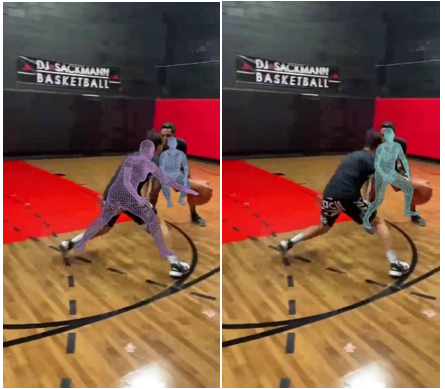
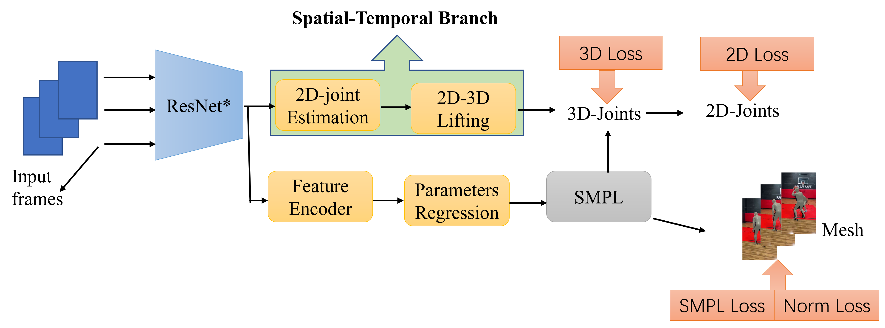

# Parallel-Branch Network for 3D Human Pose and Shape Estimation in Video



## Features

This implementation:

- has the demo and training code for our model implemented purely in PyTorch,
- can work on arbitrary videos with multiple people,
- achieves excellent results on 3DPW and MPI-INF-3DHP datasets,
- includes Temporal SMPLify implementation.
- includes the training code and detailed instruction on how to train it from scratch.
- can create an FBX/glTF output to be used with major graphics softwares.

## Getting Started

Model has been implemented and tested on Ubuntu 18.04 with python >= 3.7. You need a Nvidia GPU.

Clone the repo:

```bash
git clone https://github.com/paradoxWu/parallel-branchfor-hpe.git
```

Install the requirements using `virtualenv` or `conda`:

```bash
# pip
source scripts/install_pip.sh

# conda
source scripts/install_conda.sh
```

## Training

Run the commands below to start training:

```shell
python train.py --cfg configs/config.yaml
```

Note that the training datasets should be downloaded and prepared before running data processing script.
Please see [`doc/train.md`](doc/train.md) for details on how to prepare them.

## Evaluation

Here we compare VIBE with recent state-of-the-art methods on 3D pose estimation datasets. Evaluation metric is
Procrustes Aligned Mean Per Joint Position Error (MPJPE) in mm.

| Models    |  3DPW&#8595;  | MPI-INF-3DHP&#8595; |
| --------- | :------------: | :-----------------: |
| SPIN      |      96.9      |        105.2        |
| Pose2Mesh |      89.2      |          -          |
| VIBE      |      93.5      |        96.6        |
| Ours      | **85.7** |   **95.8**   |

| Models    |  3DPW&#8595;  | MPI-INF-3DHP&#8595; |
| --------- | :------------: | :-----------------: |
| SPIN      |      59.2      |        67.5        |
| Pose2Mesh |      58.3      |          -          |
| VIBE      |      56.5      |   **63.4**   |
| Ours      | **53.1** |         65         |

See [`doc/eval.md`](doc/eval.md) to reproduce the results in this table or
evaluate a pretrained model.

## Models



### checkpoints

| checkpoint  | Google Drive                                                                                    | Baidu Pan                                                      |
| ----------- | ----------------------------------------------------------------------------------------------- | -------------------------------------------------------------- |
| GRU         | [Google Drive](https://drive.google.com/file/d/1WJb364ACIyvYVmwYdxcIomUZ2nrmPtYg/view?usp=sharing) | [Baidu](https://pan.baidu.com/s/1V3w75BCHIc-2jqLe_znTYA?pwd=2ca9) |
| Transformer | TBD                                                                                             | TBD                                                            |

## License

This code is available for **non-commercial scientific research purposes** as defined in the [LICENSE file](LICENSE). By downloading and using this code you agree to the terms in the [LICENSE](LICENSE). Third-party datasets and software are subject to their respective licenses.

## Citation

How to cite this article:

> Wu Y, Wang C. Parallel-branch network for 3D human pose and shape estimation in video.  Comput Anim Virtual Worlds. 2022;e2078. https://doi.org/10.1002/cav.2078

## References

We indicate if a function or script is borrowed externally inside each file. Here are some great resources we
benefit:

- Pretrained HMR and some functions are borrowed from [SPIN](https://github.com/nkolot/SPIN).
- SMPL models and layer is from [SMPL-X model](https://github.com/vchoutas/smplx).
- Some functions are borrowed from [Temporal HMR](https://github.com/akanazawa/human_dynamics).
- Some functions are borrowed from [HMR-pytorch](https://github.com/MandyMo/pytorch_HMR).
- Some functions are borrowed from [Kornia](https://github.com/kornia/kornia).
- Pose tracker is from [STAF](https://github.com/soulslicer/openpose/tree/staf).
- Spatial and Temporal transformer modules are set as [PoseFormer](https://github.com/zczcwh/PoseFormer)
- Most code are borrowed from [VIBE](https://github.com/mkocabas/VIBE)
